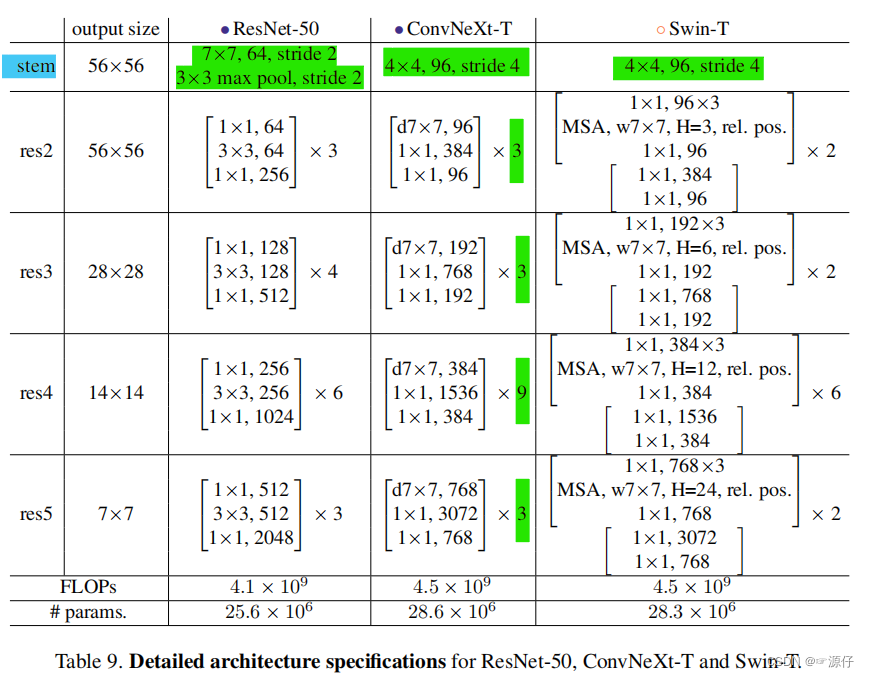

# Pytorch Tutorial  

## Pytorch Basis

1. 拼接函数：torch.stack()和torch.cat()

    **torch.stack()**: 沿着一个新维度对输入张量序列进行连接, 序列中所有的张量都应该为相同形状。

    ```python
    outputs = torch.stack(inputs, dim=0) → Tensor
    ```

    inputs : 待连接的张量序列。python的序列数据只有list和tuple。
    dim : 新的维度， 必须在0到len(outputs)之间。

    **torch.cat()**: 沿着指定维度连接张量序列。
    torch.cat() 和python中的内置函数cat()， 在使用和目的上，是没有区别的，区别在于前者操作对象是tensor.

    ```python
    outputs = torch.cat(inputs, dim=0) → Tensor
    ```

    inputs : 待连接的张量序列，可以是任意相同Tensor类型的python 序列。
    dim : 选择的扩维, 必须在0到len(inputs[0])之间，沿着此维连接张量序列

2. 分割函数 torch.chunk(), torch.split()

    **torch.chunk()**: 将张量分割成若干块，返回一个元组，元组中每个元素是一个张量，张量的形状由参数sizes指定。

    ```python  
    outputs = torch.chunk(input, chunks, dim=0) → List of Tensors
    ```

    torch.chunk(k) 是将tensor切割为k个tensor
    input : 待分割的张量
    chunks : 要分割成的块数，或者一个列表，表示每块的大小
    dim : 要分割的维度

    **torch.split()**: 将张量分割成若干块，返回一个元组，元组中每个元素是一个张量，张量的形状由参数sizes指定。

    ```python  
    outputs = torch.split(tensor, split_size_or_sections, dim=0) → List of Tensors
    ```

    tensor : 待分割的张量
    split_size_or_sections : 每一块的大小，或者一个列表，表示每块的大小
    dim : 要分割的维度

    注：chunk是指定分割数量，split是指定分割完的tensor的样式。
3. 张量操作函数 torch.clamp()

    ```python  
    torch.clamp(input, min, max, out=None) -> Tensor
    ```

    将输入input张量每个元素的夹紧到区间 [min, max]，并返回结果到一个新张量.  

## torchvision.transforms 图像处理


## tensorboard 


## CNN 

Code stripts: 

```python
import torch.nn as nn

nn.Conv1d(in_channels, out_channels, kernel_size, stride=1, padding=0, dilation=1, groups=1, bias=True)
nn.Conv2d(in_channels, out_channels, kernel_size, stride=1, padding=0, dilation=1, groups=1, bias=True)
nn.Conv3d(in_channels, out_channels, kernel_size, stride=1, padding=0, dilation=1, groups=1, bias=True)
```

Parameters：

- in_channels(`int`) – 输入信号的通道
- out_channels(`int`) – 卷积产生的通道
- kernel_size(`int` or `tuple`) - 卷积核的尺寸
- stride(`int` or `tuple`, `optional`) - 卷积步长
- padding (`int` or `tuple`, `optional`)- 输入的每一条边补充0的层数
- dilation(`int` or `tuple`, `optional`) – 卷积核元素之间的间距
- groups(`int`, `optional`) – 从输入通道到输出通道的阻塞连接数
- bias(`bool`, `optional`) - 如果 `bias=True`，添加偏置
  

一维卷积层，输入的尺度是 $(N, C_{in}, L_{in})$，输出尺度 $(N, C_{out}, L_{out})$ 的计算方式：

$$out(N_i, C_{out_j}) = bias(C_{out_j}) + \sum^{C_{in}-1}_{k=0} weight(C_{out_j}, k) \bigotimes input(N_i, k) 
$$

输入输出shape: 
Input: $(N, C_{in}, L_{in})$, Output: $(N, C_{out}, L_{out})$ 

输入输出的计算方式:  
$$L_{out} = floor((L_{in} + 2\cdot padding - dilation\cdot (kernel\_size-1) - 1) / stride + 1)
$$

变量:
- weight(`tensor`) - 卷积的权重，大小是 (out_channels, in_channels, kernel_size)
- bias(`tensor`) - 卷积的偏置系数，大小是（out_channels）


二维卷积层, 输入的尺度是 $(N, C_{in}, H, W)$，输出尺度 $(N, C_{out}, H_{out}, W_{out})$ 的计算方式：

$$out(N_i, C_{out_j}) = bias(C_{out_j}) + \sum^{C_{in}-1}_{k=0} weight(C_{out_j}, k)\bigotimes input(N_i, k)
$$

shape:
input: (N, C_in, H_in, W_in)
output: (N, C_out, H_out, W_out)

$$H_{out} = floor((H_{in}+2\cdot padding[0]-dilation[0]\cdot (kernel\_size[0]-1)-1)/stride[0] + 1)
$$

$$W_{out} = floor((W_{in}+2\cdot padding[1]-dilation[1]\cdot (kernel\_size[1]-1)-1)/stride[1] + 1) 
$$

变量:
weight(tensor) - 卷积的权重，大小是(out_channels, in_channels,kernel_size)
bias(tensor) - 卷积的偏置系数，大小是（out_channel）


### **From ResNet to ConvNeXt** 

- **Changing stage compute ratio**: 在原ResNet网络中，一般conv4_x（即stage3）堆叠的block的次数是最多的。如下图中的ResNet50中stage1到stage4堆叠block的次数是(3, 4, 6, 3)比例大概是1:1:2:1，但在Swin Transformer中，比如Swin-T的比例是1:1:3:1，Swin-L的比例是1:1:9:1。很明显，在Swin Transformer中，stage3堆叠block的占比更高。所以作者就将ResNet50中的堆叠次数由(3, 4, 6, 3)整成(3, 3, 9, 3)，和Swin-T拥有相似的FLOPs.
  
- **Changing stem to "Patchify"** : 在之前的卷积神经网络中，一般最初的下采样模块stem一般都是通过一个卷积核大小为7x7以及stride为2的卷积层以及一个stride为2的MaxPooling下采样共同组成，高和宽都下采样4倍。但在Transformer模型中一般都是通过一个卷积核非常大且相邻窗口之间没有重叠的（即stride等于kernel_size）卷积层进行下采样。比如在Swin Transformer中采用的是一个卷积核大小为4x4以及stride为4的卷积层构成patchify，同样是下采样4倍。所以作者将ResNet中的stem也换成了和Swin Transformer一样的patchify.

<center>
<p>Resnet Structure</p></center>

<center>
<p>Detailed architecture specifications for ResNet-50, ConvNeXt-T and Swin-T</p></center>


- **ResNeXt-ify**: ConvNeXt 借鉴了ResNeXt中的组卷积grouped convolution，因为ResNeXt相比普通的ResNet而言在FLOPs以及accuracy之间做到了更好的平衡。而作者采用的是更激进的depthwise convolution: 即group数和通道数channel相同，这样做的另一个原因是作者认为depthwise convolution和self-attention中的加权求和操作很相似。
- **Inverted Bottleneck**: 作者认为Transformer block中的MLP模块非常像MobileNetV2中的Inverted Bottleneck模块，即两头细中间粗。
- **Large Kernel Sizes**:
  - **Moving up depthwise conv layer**，即将depthwise conv模块上移，原来是1x1 conv -> depthwise conv -> 1x1 conv，现在变成了depthwise conv -> 1x1 conv -> 1x1 conv。这么做是因为在Transformer中，MSA模块是放在MLP模块之前的，所以这里进行效仿，将depthwise conv上移。
  - **Increasing the kernel size**，接着作者将depthwise conv的卷积核大小由3x3改成了7x7（和Swin Transformer一样），当然作者也尝试了其他尺寸，包括3, 5, 7, 9, 11发现取到7时准确率就达到了饱和
  

对于ConvNeXt网络，作者提出了T/S/B/L四个版本，这四个版本的配置如下：

- ConvNeXt-T: C = (96, 192, 384, 768), B = (3, 3, 9, 3)
- ConvNeXt-S: C = (96, 192, 384, 768), B = (3, 3, 27, 3)
- ConvNeXt-B: C = (128, 256, 512, 1024), B = (3, 3, 27, 3)
- ConvNeXt-L: C = (192, 384, 768, 1536), B = (3, 3, 27, 3)
- ConvNeXt-XL: C = (256, 512, 1024, 2048), B = (3, 3, 27, 3)
其中C代表4个stage中输入的通道数，B代表每个stage重复堆叠block的次数。
